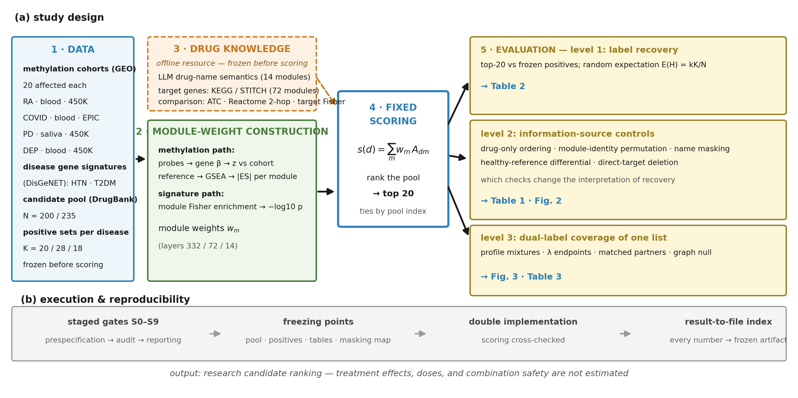
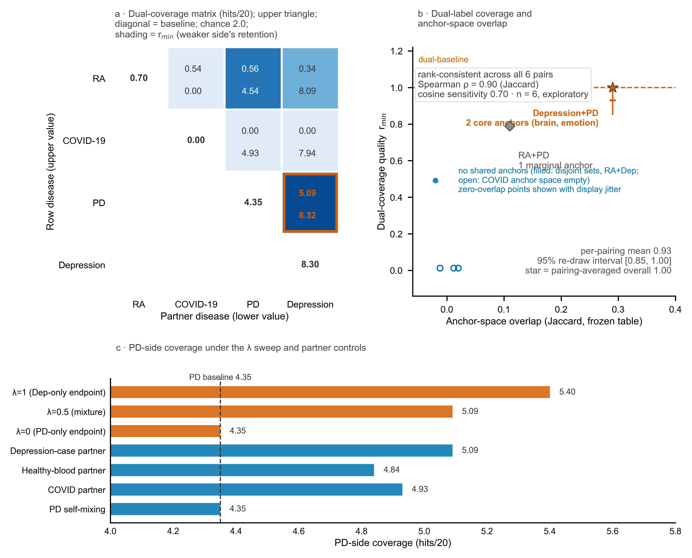

<div align="center">

# MorbiMap: Prescribing Without a Disease Diagnosis?
# MorbiMap：不依赖疾病诊断的处方排序？

**Direct Intervention Ranking from a Health State-Representation Map for the Multimorbidity Challenge**
**从健康状态表征地图直接排序候选干预·面向多病共存挑战**

[](https://steeramed.com)
[](LICENSE)
[](https://github.com/DeepoMe/SteeraMed-MorbiMap/releases/tag/v1)
[](https://www.researchgate.net/publication/415224694_Prescribing_Without_a_Disease_Diagnosis_Direct_Intervention_Ranking_from_a_Health_State-Representation_Map_for_the_Multimorbidity_Challenge)

</div>

---

[English](#english) | [中文](#中文)

---

<a name="english"></a>

## Can a health state-representation map rank candidate drugs — without a disease label?

MorbiMap is a candidate-ranking component of [SteeraMed](https://steeramed.com).
It connects a health state-representation map — the module-weighted representation of
a molecular profile — with frozen drug–module relevance
tables and uses a fixed scoring program to rank candidate drugs — **without
requiring a disease label as input to the scoring function**.

### Study design at a glance



*Four DNA-methylation cohorts and two disease-associated gene signatures → module weights → frozen drug–module tables → fixed scoring → three-level evaluation.*

### Can one list cover two disease-label sets?



*Synthetic paired-profile analyses test whether a single top-20 list can recover drugs from two disease-label sets. Depression–Parkinson's mixtures retained both baselines on average; the depression-only endpoint already attained dual coverage.*

## Key findings

- A **hypertension gene signature** recovered 6–7 antihypertensives in the top 20; removing 30 direct-target genes retained 6
- Depression and Parkinson's **high recovery was shared with healthy controls** — detected by a healthy-reference differential, not by drug-only or permutation checks
- **32%** of depression–Parkinson's pairings met both baselines; the depression-only endpoint also met both
- A degree- and weight-preserving **graph null** reproduced the overlap–coverage association (ρ_null = 0.85 vs observed 0.90)

## Repository status

> **Version 1 (preprint).** This repository provides the result-to-artifact
> index, representative figures, and version declaration. The analysis code,
> frozen candidate pools, positive-set files, drug–module tables, audit trail,
> and reproduction scripts will be released in **version 2 (v2)**.

## Result-to-artifact index

| Headline result | Frozen artifact (v2) |
|---|---|
| Candidate pool and sealed positive sets | `results/pool200_clinical_v2.json` |
| Per-participant 72-module \|ES\| profiles | `results/_repr_gsea_signed_v2.npy` + `item_map_v2.json` |
| Grounded drug–module tables (9 batches) | `results/geneanchor72_claude_batch*.json` |
| Depression and PD healthy-control differential gates | `results/e2_triangle_full.json` |
| Cross-fitted calibration | `results/e15_calibration.json` + `e15_calibration_seed7.json` |
| Per-drug differential audit | `results/e15_diff_audit.json` |
| HTN direct-target deletion, class deletion, null | `results/e16_htn_independence.json` + `e16b_classholdout.json` |
| Exhaustive pairing coverage (Table 3) | `results/comorbidity_exhaustive_means.json` |
| Self-mixing, healthy-partner controls, λ sweep | `results/e14_e17_selfmix.json` |
| Degree- and weight-preserving graph null | `results/e19_graph_null.json` |
| Blinded edge-level review package | `results/e5_blind_edge_package.xlsx` / `.json` |

## Data sources

All analyses use publicly available GEO datasets:
GSE42861, GSE179325, GSE111223, GSE113725, GSE128235, GSE44132, GSE198904, GSE201287.

## Citation

```bibtex
@preprint{xiong2026morbidmap,
  title={Prescribing Without a Disease Diagnosis? Direct Intervention Ranking
         from a Health State-Representation Map for the Multimorbidity Challenge},
  author={Xiong, Jianghui},
  year={2026},
  note={Preprint. Code and frozen artifacts:
        https://github.com/DeepoMe/SteeraMed-MorbiMap}
}
```

## Links

- **[Paper (ResearchGate version)](https://www.researchgate.net/publication/415224694_Prescribing_Without_a_Disease_Diagnosis_Direct_Intervention_Ranking_from_a_Health_State-Representation_Map_for_the_Multimorbidity_Challenge)** — preprint version; DOI to follow on preprints.org
- **[SteeraMed](https://steeramed.com)** — the broader framework
- **[DeepoMe](https://steeramed.com)** — the organization behind this work
- **[SteeraMed-RootMap](https://github.com/DeepoMe/SteeraMed-RootMap)** — companion aging-dependency repository (with paper audio & alphaXiv discussion)
- **[SteeraMed-bench](https://github.com/DeepoMe/SteeraMed-bench)** — companion benchmark repository

## License

MIT (code) / CC BY 4.0 (data and documentation)

## Contact

Jianghui Xiong — [jianghui@deepome.com](mailto:jianghui@deepome.com)

---

<a name="中文"></a>

## 健康状态表征地图能否直接排序候选药物——不需要疾病标签？

MorbiMap 是 [SteeraMed](https://steeramed.com) 框架的候选排序组件。
它将健康状态表征地图（分子谱的模块加权表征）与冻结的药物-模块关联表连接，用固定评分程序排序候选药物——**评分函数不需要疾病标签输入**。

### 研究设计一览


*四个 DNA 甲基化队列 + 两个疾病基因签名 → 模块权重 → 冻结药物-模块表 → 固定评分 → 三层评测。*

### 一份列表能否覆盖两组疾病标签？


*合成配对谱分析测试单个 top-20 列表能否覆盖两组疾病标签。抑郁-帕金森混合平均保留双基线；纯抑郁端点已达双覆盖。*

## 核心发现

- **高血压基因签名**在 top 20 中恢复 6–7 个降压药；删除 30 个直接靶基因后保留 6 个
- 抑郁与帕金森的**高恢复与健康对照共享**——由健康参照差分检出，药物排序/置换检查无法单独发现
- 抑郁-帕金森配对中 **32%** 同时达到双基线；纯抑郁端点也达到双覆盖
- 度数-权重保持的**图空模型**复现了重叠-覆盖关联（ρ_null = 0.85 vs 观测 0.90）

## 仓库状态

> **版本 1（预印本）。** 当前提供结果-文件索引、代表性图表与版本声明。
> 分析代码、冻结候选池、阳性集文件、药物-模块表、审计链与复现脚本将在**版本 2（v2）**中发布。

## 数据来源

所有分析使用公开 GEO 数据集：
GSE42861, GSE179325, GSE111223, GSE113725, GSE128235, GSE44132, GSE198904, GSE201287.

## 许可

MIT（代码）/ CC BY 4.0（数据与文档）

## 联系方式

熊江辉 — [jianghui@deepome.com](mailto:jianghui@deepome.com)

[DeepoMe](https://steeramed.com) · [SteeraMed](https://steeramed.com)
